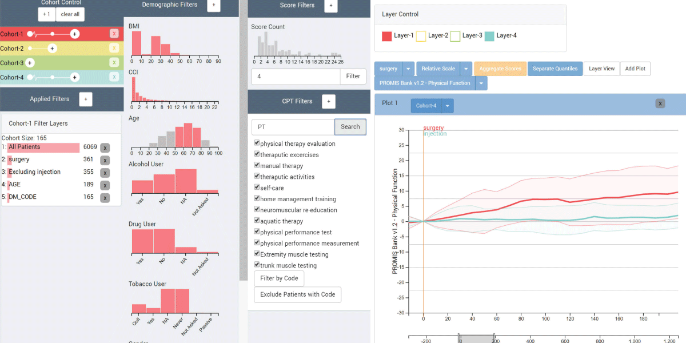

# Composer


### About
Composer is an open source visual cohort analysis tool developed in collaboration with the Univeristy of Utah Orthopaedic Center. More information can be found on the Visualization Design Lab's [webpage](http://vdl.sci.utah.edu/publications/2018_vahc_composer/).

## Running Composer

### Prerequisites 

 1. Install [Docker](https://www.docker.com/).
 2. Install [NPM](https://www.npmjs.com/).

### Installing 

 1. `cd Composer`
 2. We need the `develop` branch from `phovea_server`. There are two ways:
   * `yo phovea:clone phovea_server` (consent to `SSH clone`, `Resolve`, `Update Workspace`). 
   Then `git fetch` and `git checkout develop`
   * `git clone -b develop https://github.com/phovea/phovea_server.git`.
 3. `yo phovea:clone phovea_core` (consent to `SSH clone`, `Resolve`, `Update Workspace`). 
 4. `yo phovea:clone phovea_ui` (consent to `SSH clone`, `Resolve`, `Update Workspace`). 
 5. `npm install`
 6. `docker-compose build`

### Launching

Keep Docker running.

1. `docker-compose up -d`
2. `npm run start:client_app`

Composer will be running at `http://localhost:8080/`.

### The Data
Original patient data used for development has been excluded for privacy purposes.
To integrate your own data, you will need to create a `data` folder within the `app_server` folder.
Data is loaded into the application as a Phovea table using the Phovea server from `.csv` files. 
Within the `data` filder, you need to create an `index.json` file. This will contain an array of file object descriptions. 
Data file information needs to be specified in the `index.json` in a specific format. 
Specifications for the data file in `index.json` is described below:
```[{
        "name": "name you will use to refer to data table object",
        "path": "name of your file.csv",
        "separator": ",",
        "quotechar": "\"",
        "id": "id you want to specify for your data",
        "size": [
            rows,
            columns (excluding your index col)
        ],
        "type": "table",
        "idtype": "INDEX",
        "idcolumn": 0,
        "columns": [
            { "name": "003", "value": { "type": "string" } }
        ]
    },
...
]
```
For each column in your table, you will need to specify the name of the column and the type of data.

After adding new data, and appropriately specifying it in your `index.json` file, you can access the data from the application using:
`await this.loadDataFromServer();`

For more information on using Phovea tables see the [documentation](https://github.com/Caleydo/phovea_demos/blob/master/src/UsingTable.ts).